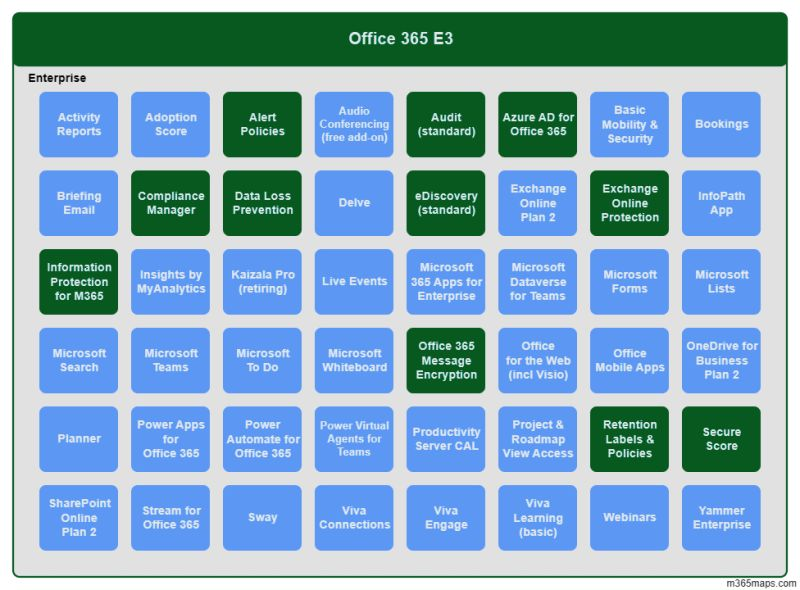

N'attendez pas d'avoir des licences Microsoft 365 E5 pour mettre en œuvre la gouvernance et la protection de vos données sensibles. Vos licences Office 365 E3 vous permettent de démarrer en toute sérénité.

Au menu avec Office 365 E3 : 

1️⃣ Classification (identification) de vos données sensibles au travers de "Sensitive Information Types" natifs ou personnalisés,

2️⃣ Gestion du cycle de vie des données sans ou avec étiquettes (étiquetage manuel), protection des données via étiquettes de confidentialité (étiquetage manuel)

3️⃣ Prévention contre la fuite des données (DLP) sur vos e-mails Exchange Online, et vos documents SharePoint Online, Teams et OneDrive for Business

4️⃣ Audit de vos stratégies avec le Compliance Manager, 

5️⃣ Sans oublier la recherche de données

6️⃣ Et une solution d'investigation eDiscovery.

Les licences "M365 Compliance E5" quant à elles apporteront, entre autres les avantages suivants :

⬆ Un plus grand panel de mécanismes de classification, de protection, DLP, et de gestion du risque 

🔁 Une automatisation avancée de l'étiquetage des documents et des e-mails 

🌐 Mais aussi un périmètre plus large d'emplacements de données pouvant être gouvernées et protégées

Crédits image : m365maps.com

