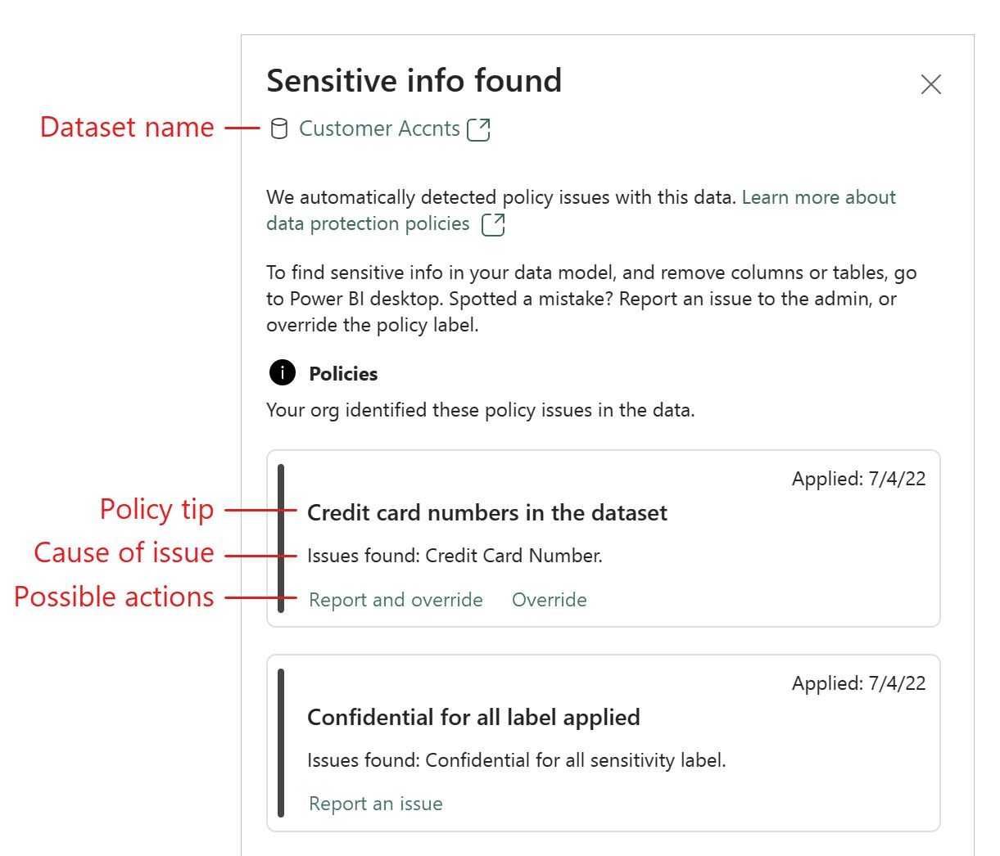

Vous pouvez déployer des stratégies de DLP au sein de vos espaces de travail PowerBI !

✔ Ce qui est possible de faire à ce jour

👉Exécuter une règle DLP pour évaluer vos données lorsque l'une des actions suivantes est effectuée sur votre Dataset : Publish / Republish / On-demand refresh / Scheduled refresh

👉 Identifier au sein d'un Dataset des contenus selon un Type d'Information Sensible (SIT) ou une étiquette de protection (Sensitivity Label)

👉 Afficher un "policy tip" si la ou les conditions de la règle DLP sont réunies

👉 Enregistrer une justification pour outrepasser la règle DLP : une justification business ou une justification de type "Faux-positif". La règle DLP est ensuite ignorée et la policy tip ne s'affiche plus. 

 
❌Ce qui n'est pas (encore?) possible de faire

👉 Utiliser un classifier de type "Exact Data Match" ou "Trainable Classifier"

👉Configurer une action de blocage / protection si la ou les conditions de la règles DLP sont réunies (La stratégie DLP est donc "informative" pour le moment)

👉Utiliser un modèle de stratégie DLP préconfiguré par Purview. Il faut obligatoirement configurer une stratégie "Custom"

⚠Les prérequis à respecter
👉 Avoir défini des "workspaces" et que ceux-ci soient hébergés avec des capacités Premium (et l'évaluation DLP ajoute un 30% de CPU consommé à la conso CPU totale, par exemple lorsque une action de type "Refresh" est exécutée)

👉 L'administrateur Purview en charge de configurer la stratégie DLP doit avoir une licence "M365 E5" ou "M365 E5 Compliance" ou "M365 E5 IPG"

👉 Avoir un dataset qui ne soit pas de type "Sample", "Streaming","Direct Query" ou hybride/"mixed". Seuls les data set de type "Import" sont pris en charge aujourd'hui

