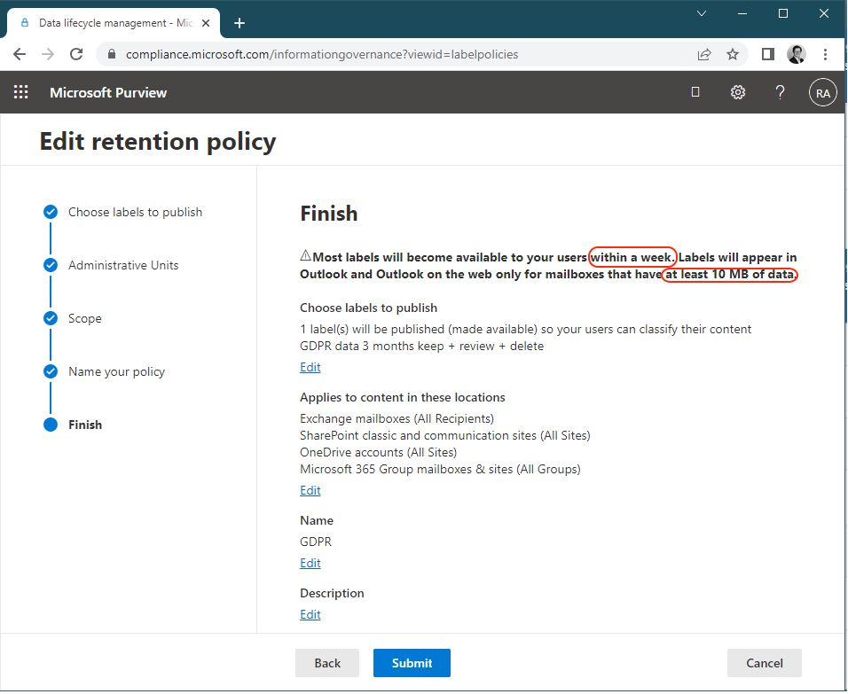

Si vous déployez des étiquettes de rétention au sein des messageries Exchange Online de votre tenant, et qu'un de vos utilisateurs vous "alerte" qu'il n'a pas accès à ces étiquettes (mais le fera-t-il vraiment ? 😁), gardez bien en tête les points de vérification suivants avant de suspecter une anomalie des services Office 365

⏲ Le déploiement peut (officiellement) prendre jusqu'à 7 jours pour atteindre l'ensemble des messageries ciblées

📦 Une boite e-mail Exchange Online doit peser plus de 10 Mo de contenu, sans cela la ou les étiquettes ne seront jamais disponibles !

👉 En conclusion, lors de la création d'un nouvelle messagerie pour un collaborateur, il est normal que les étiquettes ne soient pas immédiatement disponibles.

