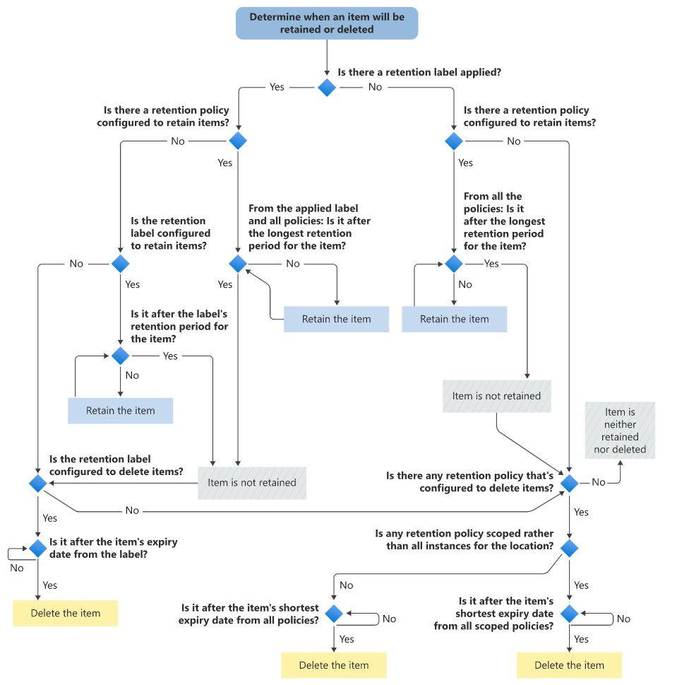

Avec Microsoft Purview, il est possible qu'un document ou un e-mail soit associé à plusieurs périodes de rétention et/ou effacement en même temps (via une stratégie globale ET une étiquette notamment).

❓ Que se passe-t-il dans ce cas ?
Tout simplement, un ensemble de 4 "principes" s'appliquent, dans l'ordre de priorité suivant : 

1️⃣ Keep before Delete : La rétention l'emporte sur la destruction

2️⃣ Keep as long as possible : La plus longue période de rétention reste en vigueur

3️⃣ "Explicit" is better than "implicit" : Une étiquette est prioritaire à une stratégie globale pour les règles de rétention ou de destruction (entre autres)

4️⃣ Delete as soon as possible : La plus courte période avant destruction reste en vigueur

🤔 Faites-moi un schéma, pour être sûr de bien comprendre 👇
(crédits : https://learn.microsoft.com/en-us/purview/retention-flowchart)
