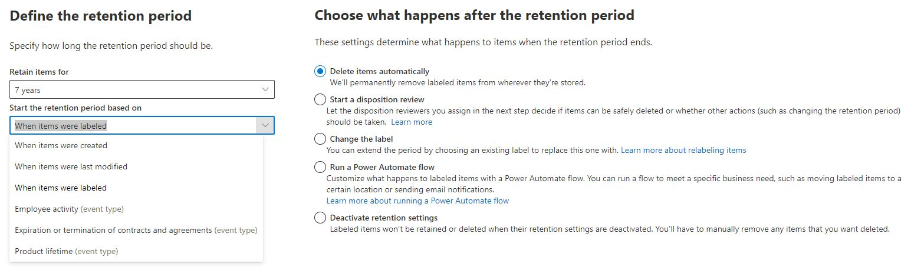

Avec #Microsoft #Purview, vous pouvez configurer trois types d'étiquettes de rétention pour gérer le cycle de vie et l'intégrité de vos documents.

En voici une description rapide, de la plus à la moins déployée (généralement) par les entreprises

1️⃣ Une étiquette de type "standard" : elle active sur un document (ou un e-mail) une période de rétention (ou pas) puis différentes options à l'issue de cette période, notamment : une 🗑 destruction avec (ou sans) étape d'approbation, un 🔃 changement d'étiquette, un ⚙ workflow métier (Flow PowerAutomate), ou tout simplement 🛑 aucune action particulière : le document n'est alors plus soumis à une quelconque règle de rétention. (Cf. capture d'écran en bas de ce post)

2️⃣ Une étiquette de type "Record" ("Enregistrement") : en plus du cycle de vie décrit ci-dessus, un 🔐 verrou est appliqué sur le document, bloquant toute modification ou suppression par un utilisateur/contributeur du document (et autres caractéristiques). 

3️⃣ Une étiquette de type "Regulatory Record", afin de 🔐 📃 figer un document à l'état de "Record" pour des raisons règlementaires strictes.

⚠ Attention ⚠ Une fois cette étiquette posée sur un document (ou un e-mail), celle-ci est immuable à vie. 
Même Microsoft ne pourra retirer l'étiquette du document visé. Comme son nom l'indique, cette étiquette ne doit être utilisée qu'en cas d'extrême obligation… (A ne pas tester sur un environnement de production 😉)

