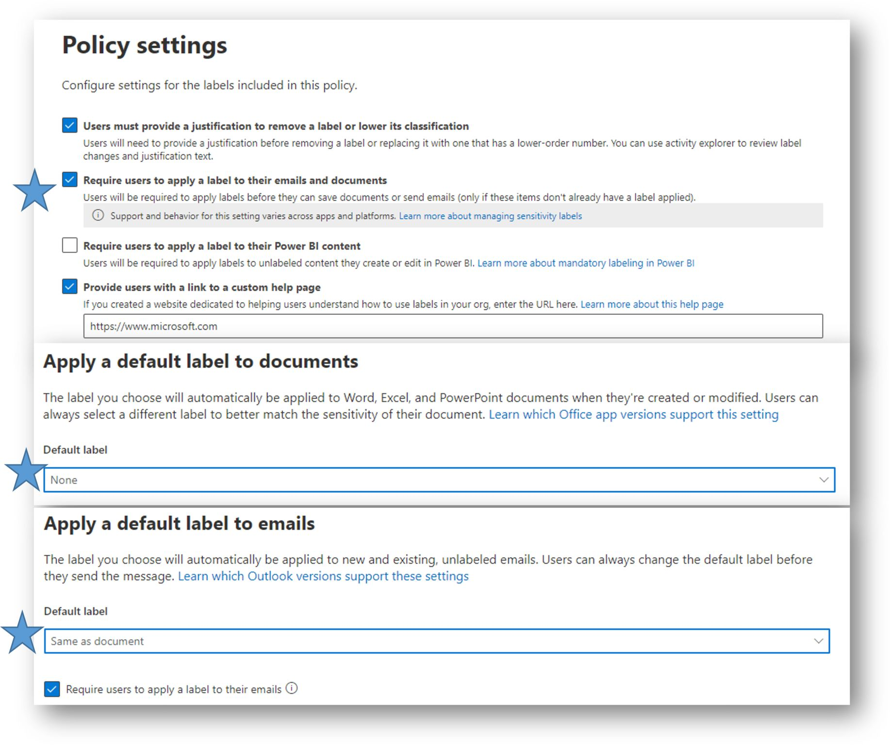

Une astuce très courte, mais ULTRA importante à savoir !

Entre d'une part un étiquetage manuel ET optionnel d'un document, et d'autre part un étiquetage automatique basé sur des règles, vous disposez de deux niveaux de stratégies de protection intermédiaires.

1️⃣ Obliger l'utilisateur à sélectionner une étiquette de protection lors de la création d'un nouveau document (et/ou e-mail, et/ou PowerBI, et/ou meetings Teams/Outlook).

2️⃣ Appliquer une étiquette par défaut à tout document non étiqueté.

Vous disposez donc de 4 étages pour votre fusée 🚀 #DataProtection 🚀, du plus permissif au plus industrialisé (les étages 2, 3 et 4 n'étant pas exclusifs entre eux).
😲 Etiquetage manuel et optionnel => un document avec du contenu sensible peut circuler de manière permanente sans étiquette de confidentialité, ni protection associée
👍Etiquetage manuel mais obligatoire => un utilisateur devra choisir une étiquette avant de sauvegarder ou de fermer son document
👌Etiquetage par défaut => Si un utilisateur ouvre un document qui n'a pas encore d'étiquette, alors ce document va automatiquement recevoir une étiquette par défaut, sans analyse du contenu
💎 Etiquetage automatisé => A l'édition du document ou en arrière plan, le contenu du document est analysé et s'il y a correspondance avec un "Classifier" (hashtag#DataClassification), et selon d'autres règles sous-jacentes, une étiquette sera appliquée au document SELON le contenu.

Pour cela, n'oubliez pas de mettre à jour les paramètres de la stratégie de publication de vos étiquettes 👇 

