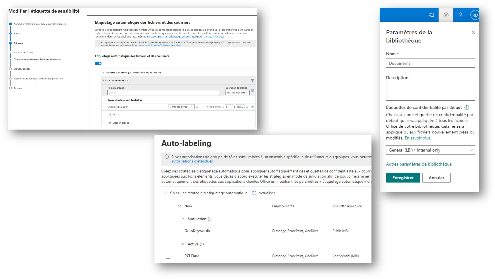

Pour mettre en place avec #Microsoft #Purview une stratégie d'étiquetage automatique pour la protection de vos documents, vous pouvez procéder de trois manières :

1️⃣ Via une stratégie "Client Side" : l'étiquette est appliquée automatiquement (ou à minima recommandée) lorsque le document est ouvert/modifié par un utilisateur
👉 La configuration de la règle s'effectue au travers du paramétrage de l'étiquette.

2️⃣ Via une stratégie "Service Side" : les documents (stockés sur Office 365 ou ailleurs) sont analysés en arrière-plan, et selon les règles d'étiquetage en vigueur, le document est étiqueté (ou non)
👉 La configuration de la règle s'effectue au travers du paramétrage d'une "auto-labeling policy".

3️⃣ En spécifiant une étiquette de protection par défaut sur une bibliothèque : tout document créé ou déposé dans cette bibliothèque est alors étiqueté en conséquence (avec conditions)
👉 La configuration de la règle s'effectue au travers du paramétrage de la bibliothèque visée.

