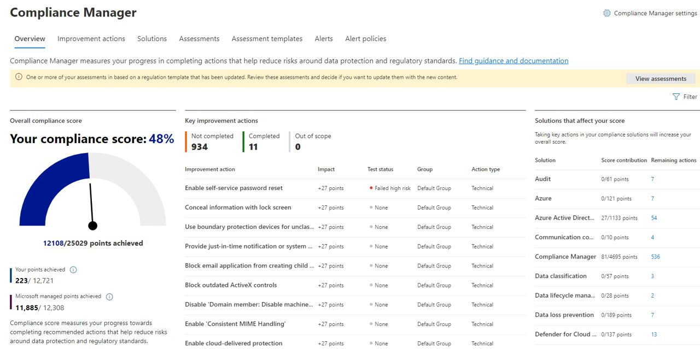

Avec le #ComplianceManager de Microsoft #Purview, mesurez et améliorez votre "score de conformité" (et de sécurité) au travers d'évaluations préconfigurées selon différentes thématiques et règlementations (RGPD, ISO27001, et bien d'autres).

🎯 Une fois l'évaluation terminée, vous disposez d'une feuille de route composée d'actions d'améliorations à mener pour augmenter votre "score" et donc, votre conformité aux règlementations visées.

📝 Ces actions sont classées par "solutions" et chacune d'elles peut être documentée pour indiquer, par exemple, son statut d'implémentation, une date prévisionnelle de déploiement, des commentaires, etc.

💎Il est également possible de procéder de manière automatisée à la mise à jour de leur statut d'avancement, en fonction des stratégies configurées au sein de Purview, d'AAD, ou autre. Pour cela, il suffit d'activer l'évaluation automatisée via les paramètres du Compliance Manager.

