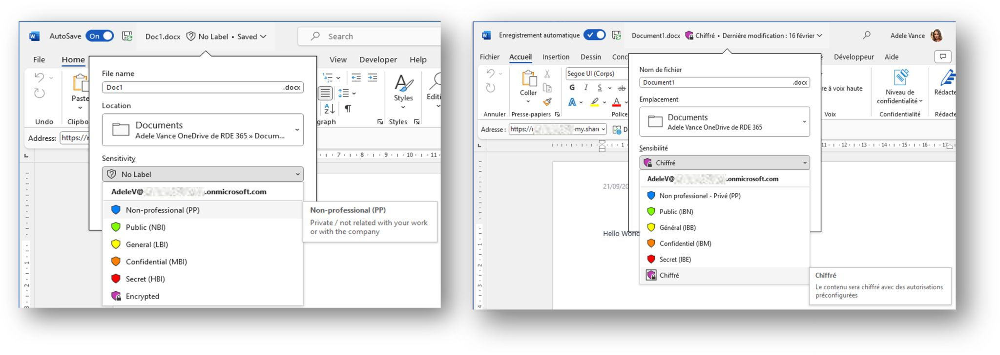

Pour adapter vos étiquettes de confidentialité/protection aux différentes langues de travail utilisées au sein de votre organisation, vous pouvez appliquer des traductions à deux niveaux :

1️⃣ Le nom d'affichage de l'étiquette, tel qu'il apparait à l'écran

2️⃣ La description de l'étiquette, qui est affichée à l'utilisateur sous forme d'infobulle

