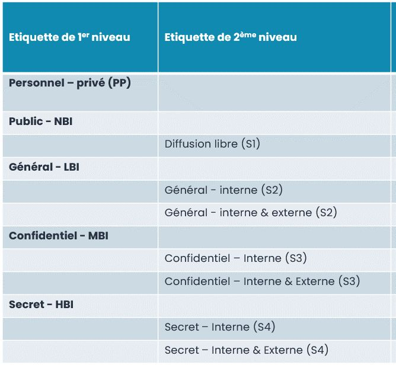

Avec #MicrosoftPurview, vous pouvez définir votre taxonomie d'étiquettes de protection selon une hiérarchie à 2 niveaux.

Pourquoi 2 niveaux? 
Par exemple, le libellé de niveau 1 définit le niveau de confidentialité du contenu, tandis que l'étiquette de niveau 2 définit le périmètre global de diffusion autorisé (ou un contexte de projet confidentiel : Fusion/Acquisition, investigation, Conseil de surveillance...)

Toutes les étiquettes ne doivent pas être publiées à tous les utilisateurs par ailleurs!

D'autres stratégies sont bien sûr possibles, pour implémenter au mieux votre classification PSSI : voici un exemple (parmi d'autres) d'une taxonomie d'étiquettes.

**[EDIT 20/03/24]** Dorénavant je ne propose pas obligatoirement des étiquettes de Niveau 2 pour le le niveau de confidentialité "Général"

